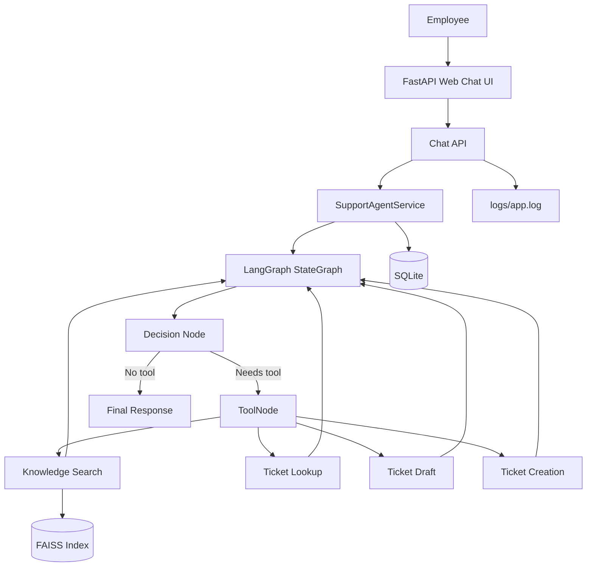
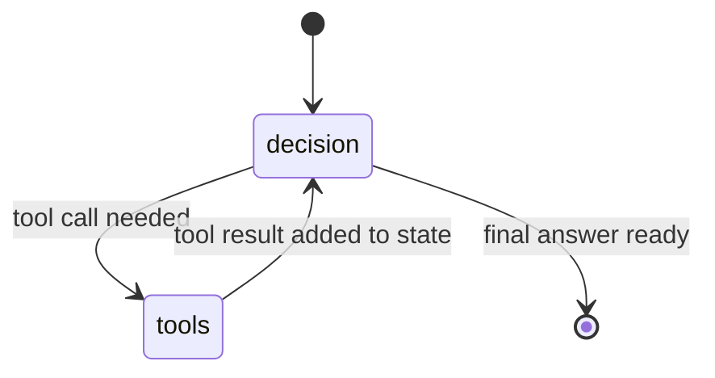

# AI Operations Assistant

An Agentic AI based IT support assistant for a fictional organization. The assistant understands an employee request, decides which tool to use, executes that tool, keeps conversation state, and returns a helpful response.

The project uses FastAPI with a simple HTML/CSS/JS chat UI. Streamlit is intentionally not used.

## Evaluator Quick Setup

1. Create and activate a virtual environment:

```powershell
python -m venv .venv
.\.venv\Scripts\Activate.ps1
```

2. Install dependencies:

```powershell
pip install -r requirements.txt
```

3. Create the local environment file:

```powershell
Copy-Item .env.example .env
```

4. Add your OpenAI API key in `.env`:

```text
OPENAI_API_KEY=your-api-key
```

5. Build the local FAISS knowledge index:

```powershell
python -m scripts.ingest_knowledge_base
```

6. Seed sample ticket data:

```powershell
python -m scripts.seed_sample_tickets
```

7. Run the application:

```powershell
uvicorn app.main:app --reload
```

8. Open the chat UI:

```text
http://127.0.0.1:8000
```

9. Try these sample prompts:

```text
My VPN is not working. Please create a ticket. My employee ID is EMP1024.
```

```text
Show tickets for EMP1024
```

```text
What is the status of ticket IT-0001?
```

10. Check runtime logs:

```text
logs/app.log
```

## EC2 Docker Deployment

Use this path when deploying on an AWS EC2 instance.

1. SSH into the EC2 instance:

```bash
ssh -i your-key.pem ubuntu@your-ec2-public-ip
```

2. Install Docker and Docker Compose plugin if they are not already installed:

```bash
sudo apt update
sudo apt install -y docker.io docker-compose-plugin git
sudo usermod -aG docker $USER
```

Log out and SSH back in so the Docker group permission is applied.

3. Clone the repository and enter the project folder:

```bash
git clone <your-repository-url>
cd "AI Operation Assistant"
```

4. Create the `.env` file:

```bash
cp .env.example .env
nano .env
```

Set:

```text
OPENAI_API_KEY=your-api-key
```

5. Build the Docker image:

```bash
docker compose build
```

6. Create the FAISS knowledge index inside Docker:

```bash
docker compose run --rm app python -m scripts.ingest_knowledge_base
```

7. Seed sample tickets:

```bash
docker compose run --rm app python -m scripts.seed_sample_tickets
```

8. Start the application:

```bash
docker compose up -d
```

9. Check logs:

```bash
docker compose logs -f app
```

10. Open the app in the browser:

```text
http://your-ec2-public-ip:8000
```

Make sure the EC2 security group allows inbound TCP traffic on port `8000`.

Useful Docker commands:

```bash
docker compose ps
docker compose restart app
docker compose down
```

## Problem Statement

Internal employees often ask IT for help with VPN, MFA, password, Outlook, software access, and ticket updates. The goal is to build a local AI assistant that can:

- Answer from internal IT documentation.
- Look up existing support tickets.
- Prepare and create support tickets.
- Maintain chat context across messages.
- Avoid creating tickets without human confirmation.

## Solution Overview

The user sends a message from the web UI. FastAPI passes it to a LangGraph workflow. The model decides whether a tool is needed. If yes, LangGraph routes execution to the selected tool and then returns to the model to generate the final response.

Main tools:

- `knowledge_search`: searches local IT documentation through FAISS.
- `ticket_lookup`: searches local SQLite support tickets.
- `ticket_draft`: prepares ticket details for review.
- `ticket_creation`: creates the ticket only after user confirmation.

## Architecture



## LangGraph Flow



Graph files:

- `app/agent/support_agent_state.py`: graph state fields.
- `app/agent/support_agent_graph.py`: nodes, edges, conditional routing, tool execution.
- `app/agent/support_agent_service.py`: loads history, invokes graph, stores messages.

## Technology Stack

- Python
- FastAPI
- LangGraph
- LangChain tool calling
- OpenAI chat and embedding models
- FAISS vector search
- SQLite with SQLAlchemy
- HTML, CSS, JavaScript

## Project Structure

```text
app/
  agent/                 LangGraph state, graph, prompt, orchestration
  api/                   FastAPI routes and response schemas
  database/              SQLAlchemy database setup and models
  knowledge/             document extraction, chunking, embedding, FAISS store
  services/              conversation, ticket, memory, draft services
  tools/                 agent tools
  web/                   browser chat UI
data/
  knowledge_base/        sample IT documentation
scripts/
  ingest_knowledge_base.py
  seed_sample_tickets.py
static_files/
  flow.png               architecture image used in README
Dockerfile               container image definition
docker-compose.yml       EC2/local Docker runtime setup
.dockerignore            files excluded from Docker build context
```

## Setup

Run from the project root:

```powershell
python -m venv .venv
.\.venv\Scripts\Activate.ps1
pip install -r requirements.txt
Copy-Item .env.example .env
```

Set your API key in `.env`:

```text
OPENAI_API_KEY=your-api-key
```

Optional settings are already provided in `.env.example`:

```text
OPENAI_CHAT_MODEL=gpt-4o-mini
OPENAI_EMBEDDING_MODEL=text-embedding-3-small
DATABASE_URL=sqlite:///./data/operations_assistant.db
FAISS_INDEX_DIRECTORY=./data/faiss_index
KNOWLEDGE_BASE_DIRECTORY=./data/knowledge_base
```

## Ingest Knowledge Base

The assistant searches files from `data/knowledge_base/`. Supported formats are TXT, Markdown, PDF, and DOCX.

```powershell
python -m scripts.ingest_knowledge_base
```

This creates a local FAISS index in `data/faiss_index/`. That folder is ignored by git because each developer can generate it locally.

## Seed Sample Tickets

The SQLite database is local and ignored by git. To create demo ticket data for lookup testing, run:

```powershell
python -m scripts.seed_sample_tickets
```

This creates two sample conversations and tickets:

- `EMP1024`: VPN connection stuck on connecting.
- `EMP2048`: Outlook desktop app not syncing emails.

You can then ask:

```text
Show tickets for EMP1024
```

or:

```text
What is the status of the VPN ticket?
```

## Run The Application

```powershell
uvicorn app.main:app --reload
```

Open:

```text
http://127.0.0.1:8000
```

API docs:

```text
http://127.0.0.1:8000/docs
```

## Usage

Try these examples in the chat UI:

```text
VPN is not working
```

```text
Please create a ticket for this VPN issue
```

```text
I confirm creation of the proposed ticket
```

```text
What is the status of ticket IT-0001?
```

The sidebar stores chat sessions. Use `New` to start a new chat. Use `Delete` on a sidebar card to remove an older chat.

## Main API Endpoints

- `POST /conversations`: create a chat session.
- `GET /conversations`: list chat sessions.
- `GET /conversations/{conversation_id}`: get chat history.
- `DELETE /conversations/{conversation_id}`: delete a chat session.
- `POST /conversations/{conversation_id}/messages`: send a message to the agent.
- `GET /tickets`: list/search tickets.
- `GET /tickets?employee_id=EMP1024`: list tickets for an employee.
- `GET /tickets/{ticket_number}`: get one ticket.
- `GET /knowledge/search?query=vpn`: search knowledge base directly.

## Logging

Runtime logs are written to:

```text
logs/app.log
```

The log captures:

- Chat input.
- Chat output.
- LangGraph node execution.
- LangGraph route decisions.
- Current graph state snapshots.
- Tool calls and tool output.
- Errors.
- Deleted conversations.

Example:

```text
INFO | operations_assistant.chat | chat.input | conversation_id=... | message=VPN is not working
INFO | operations_assistant.graph | graph.node | node=decision | state={...}
INFO | operations_assistant.graph | graph.route | from=decision | to=tools | requested_tools=['knowledge_search']
INFO | operations_assistant.graph | graph.node | node=tools | requested_tools=['knowledge_search'] | state={...}
INFO | operations_assistant.agent | tool.call | conversation_id=... | tool=knowledge_search | output=...
INFO | operations_assistant.chat | chat.output | conversation_id=... | response=...
```

`*.log` files are ignored by git.

## Key Design Decisions

- FastAPI UI is used instead of Streamlit for a lightweight web app experience.
- SQLite is used as the local database for conversations, drafts, and tickets.
- FAISS is used for faster local vector retrieval.
- Ticket creation is split into draft and creation tools so a human confirms details first.
- Conversation state is stored in SQLite and summarized for longer chats.
- Tool messages are stored in the database and also written to logs for visibility.

## Limitations

- Duplicate ticket prevention is guided by the prompt but not enforced as a hard rule.
- The local database is ignored by git, so existing ticket history is not shared automatically.
- The application has no authentication because this is a local demo project.
- Real enterprise integrations are intentionally out of scope.
